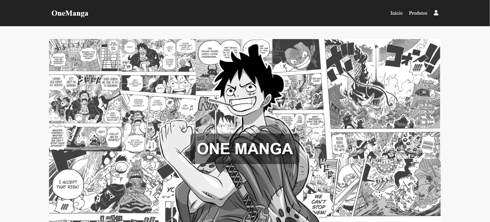
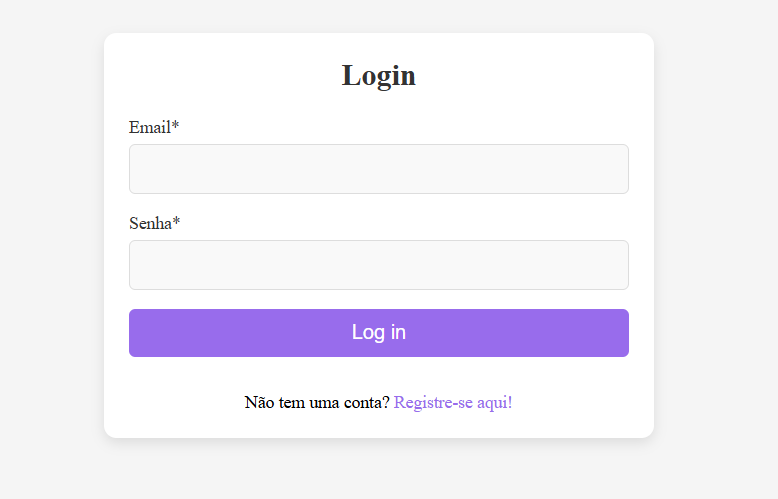
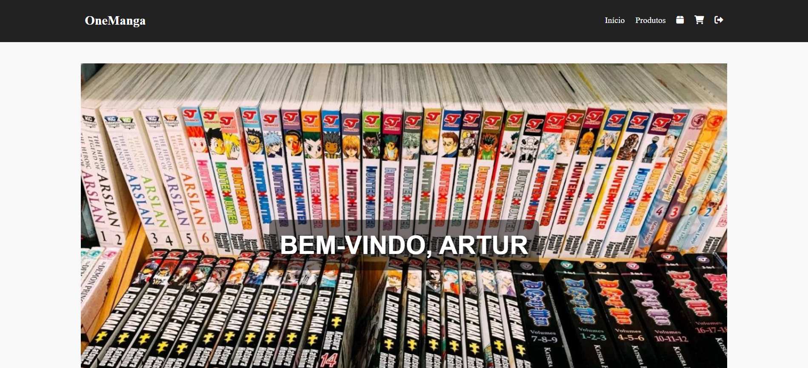
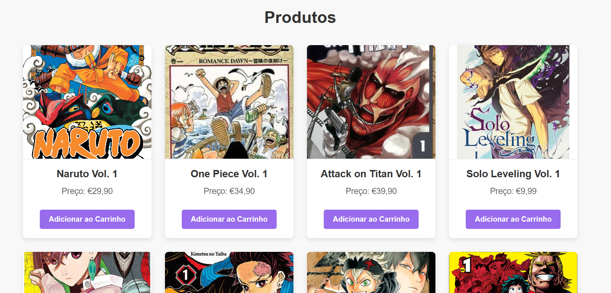
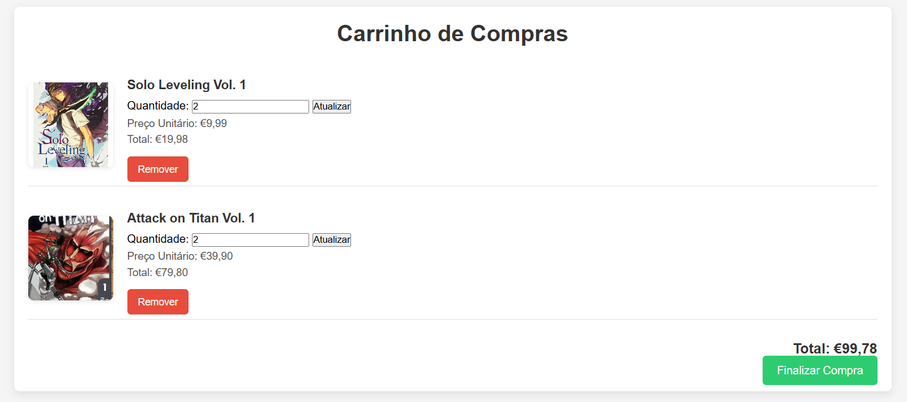
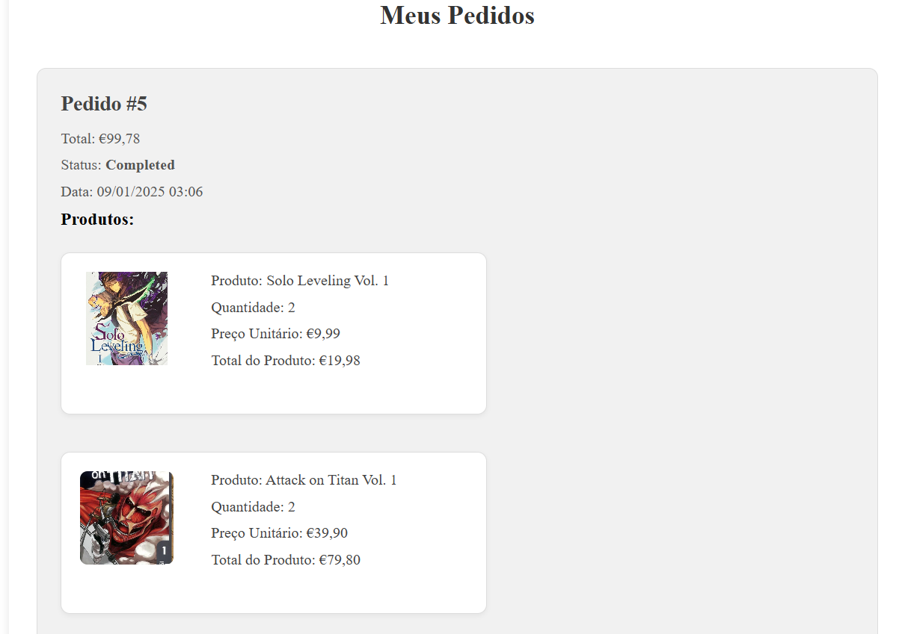

# LojaManga

## Descrição Geral
 Loja online de mangás japoneses

    

## Link
#### http://onemanga.freesite.online/LojaManga/views/login.php

## Desenvolvedores
#### Artur Guerreiro e Victor Coitinho.

## Linguagens

    

## Detalhes
### Login
 Página que faz a autenticação do utilizador e permite mudar para a pagina de registro caso não tenha uma conta.

    

### Registro
 Página que permite o visitante criar uma conta para entrar no site e fazer seus pedidos de mangás.

    

### Página Principal
 Página que faz a autenticação do utilizador e permite 
 mudar para a pagina de registo caso não tenha uma conta.

    

### Produtos
 Página que apresenta os mangás a venda e os preços de cada, além de permitir o utilizador mandar para o carrinho os produtos que ele quer.

    

### Carrinho
 Página que apresenta os produtos adicionados no carrinho e o preço total dos produtos no carrinho, além da opção de finalizar compra e mandar os produtos para a pagina dos pedidos.

    

### Pedidos
 Página que apresenta os mangás que foram pedidos, ordenados pelo pedido mais recente para o mais antigo.

    

